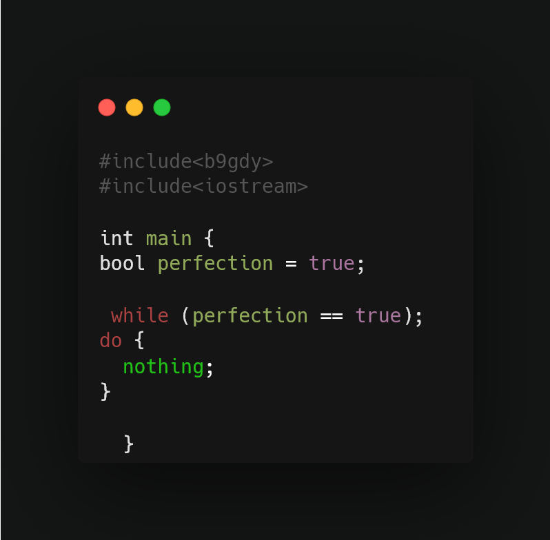

<h1 align="center">Hi 👋, I'm b9gdy</h1>
<h3 align="center">A passionate C++ developer.</h3>
</a>

- 👨‍💻 All of my projects are available at [https://github.com/b9gdy](https://github.com/b9gdy)

- 📫 How to reach me **bogdanghiorghe0@gmail.com**

<h3 align="left">Connect with me:</h3>

<h3 align="left">Languages:</h3>

   

